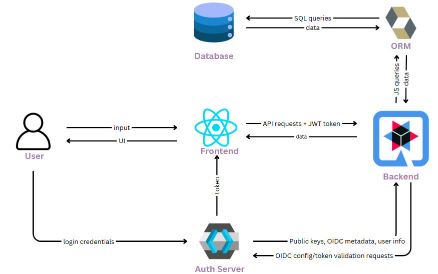

# Manchester - University Management System

A full-stack university management platform built with React (frontend), Quarkus (backend), Keycloak (authentication), and PostgreSQL (database).

---

## Table of Contents
- [Overview](#overview)
- [Features](#features)
- [Tech Stack](#tech-stack)
- [Project Structure](#project-structure)
- [Setup & Installation](#setup--installation)
- [Authentication & Authorization](#authentication--authorization)
- [Database](#database)
- [Usage](#usage)
- [Development](#development)
- [License](#license)

---

## Overview
Manchester is a university management system supporting roles for admin, lecturer, and student. It provides dashboards, course management, enrollment, and secure authentication using Keycloak.

---

## Features
- Secure login and role-based access (admin, lecturer, student)
- Course and module management
- Student enrollment and profile management
- Lecturer dashboard and student management
- Admin dashboard for department, lecturer, and student control
- Responsive, modern UI

---

## Tech Stack
- **Frontend:** React, TypeScript, Tailwind CSS
- **Backend:** Quarkus (Java)
- **Authentication:** Keycloak
- **Database:** PostgreSQL

---

## System Architecure



## Setup & Installation
### Prerequisites
- Node.js & npm
- Java 17+
- PostgreSQL
- Keycloak (bundled)

### 1. Database Setup
- Ensure PostgreSQL is running.
- Create a database named `manchester_db`.
- Update credentials in `university/src/main/resources/application.properties` if needed.

### 2. Keycloak Setup
- Start Keycloak server:
  ```
  cd keycloak-26.4.7
  bin/kc.bat start-dev
  ```
- Import or configure the `university` realm, clients, and roles (admin, lecturer, student).

### 3. Backend Setup
- Build and run the backend:
  ```
  cd university
  ./mvnw compile quarkus:dev
  ```

### 4. Frontend Setup
- Install dependencies and start:
  ```
  cd university-frontend
  npm install
  npm run start
  ```
---

## Authentication & Authorization
- **Keycloak** manages user login, roles, and permissions.
- The frontend uses Keycloak JS for authentication and token management.
- Protected routes/components check user roles and redirect as needed.
- Backend validates tokens for API requests and enforces role-based access.

## Database
- **PostgreSQL** is used for all persistent data.
- Connection details are in `application.properties`.
- No pgAdmin is required; use any PostgreSQL client for management.

## Usage
- Access the app at [http://localhost:3000](http://localhost:3000)
- Login with credentials set up in Keycloak.
- Users are redirected to their dashboard based on role.

---

### Useful Commands
- **Frontend:**
  - `npm run start` — Start development server
  - `npm run build` — Build for production
- **Backend:**
  - `./mvnw quarkus:dev` — Start backend in dev mode
- **Keycloak:**
  - `bin/kc.bat start-dev` — Start Keycloak server
  
---

## License
This project is licensed under the MIT License.
